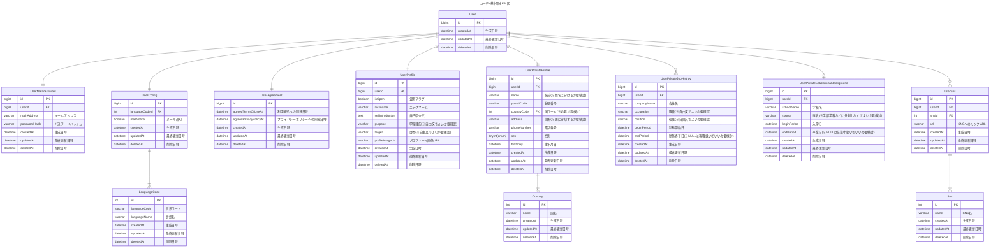

# ER 図

## ユーザー

```mermaid

---
title: ユーザー基本部分 ER 図
---

erDiagram
    User ||--|| UserMailPassword : ""
    User ||--|| UserConfig : ""
    UserConfig ||--|{ LanguageCode : ""
    User ||--|| UserAgreement : ""
    User ||--|| UserProfile : ""
    User ||--|| UserPrivateProfile : ""
    UserPrivateProfile ||--|{ Country : ""
    User ||--o{ UserPrivateJobHistroy : ""
    User ||--o| UserPrivateEducationalBackground : ""
    User ||--o{ UserSns : ""
    UserSns ||--|{ Sns : ""

    User {
        bigint id PK
        datetime createdAt "生成日時"
        datetime updatedAt "最終更新日時"
        datetime deletedAt "削除日時"
    }

    UserMailPassword {
        bigint id PK
        bigint userId FK
        varchar mainAddress "メールアドレス"
        varchar passwordHadh "パスワードハッシュ"
        datetime createdAt "生成日時"
        datetime updatedAt "最終更新日時"
        datetime deletedAt "削除日時"
    }

    UserConfig {
        bigint id PK
        int languageCodeId FK
        boolean mailNotice "メール通知"
        datetime createdAt "生成日時"
        datetime updatedAt "最終更新日時"
        datetime deletedAt "削除日時"
    }

    UserAgreement {
        bigint id PK
        datetime agreedTermsOfUseAt "利用規約への同意日時"
        datetime agreedPrivacyPolicyAt "プライバシーポリシーへの同意日時"
        datetime createdAt "生成日時"
        datetime updatedAt "最終更新日時"
        datetime deletedAt "削除日時"
    }

    UserProfile {
        bigint id PK
        bigint userId FK
        boolean isOpen "公開フラグ"
        varchar nickname "ニックネーム"
        text selfIntroduction "自己紹介文"
        varchar purpose "学習目的(※自由文でよいか要確認)"
        varchar target "目標(※自由文でよいか要確認)"
        varchar profileImageUrl "プロフィール画像URL"
        datetime createdAt "生成日時"
        datetime updatedAt "最終更新日時"
        datetime deletedAt "削除日時"
    }

    UserPrivateProfile {
        bigint id PK
        bigint userId FK
        varchar name "名前(※姓名に分けるか要検討)"
        varchar postalCode "郵便番号"
        int countryCode FK "国コード(※必要か要検討)"
        varchar address "住所(※更に分割するか要検討)"
        varchar phoneNumber "電話番号"
        tinyint(enum) sex "性別"
        datetime birthDay "生年月日"
        datetime createdAt "生成日時"
        datetime updatedAt "最終更新日時"
        datetime deletedAt "削除日時"
    }

    UserPrivateJobHistroy {
        bigint id PK
        bigint userId FK
        varchar companyName "会社名"
        varchar occupation "職種(※自由文でよいか要確認)"
        varchar position "役職(※自由文でよいか要確認)"
        datetime beginPeriod "勤務開始日"
        datetime endPeriod "勤務終了日(※NULLは現職扱いでいいか要検討)"
        datetime createdAt "生成日時"
        datetime updatedAt "最終更新日時"
        datetime deletedAt "削除日時"
    }

    UserPrivateEducationalBackground {
        bigint id PK
        bigint userId FK
        varchar schoolName "学校名"
        varchar course "専攻(※学部学科などに分割しなくてよいか要検討)"
        datetime beginPeriod "入学日"
        datetime endPeriod "卒業日(※NULLは在籍中扱いでいいか要検討)"
        datetime createdAt "生成日時"
        datetime updatedAt "最終更新日時"
        datetime deletedAt "削除日時"
    }

    UserSns {
        bigint id PK
        bigint userId FK
        int snsId FK
        varchar url "SNSへのリンクURL"
        datetime createdAt "生成日時"
        datetime updatedAt "最終更新日時"
        datetime deletedAt "削除日時"
    }

    LanguageCode {
        int id PK
        varchar languageCode "言語コード"
        varchar languageName "言語名"
        datetime createdAt "生成日時"
        datetime updatedAt "最終更新日時"
        datetime deletedAt "削除日時"
    }

    Country {
        int id PK
        varchar name "国名"
        datetime createdAt "生成日時"
        datetime updatedAt "最終更新日時"
        datetime deletedAt "削除日時"
    }

    Sns {
        int id PK
        varchar name "SNS名"
        datetime createdAt "生成日時"
        datetime updatedAt "最終更新日時"
        datetime deletedAt "削除日時"
    }

```
