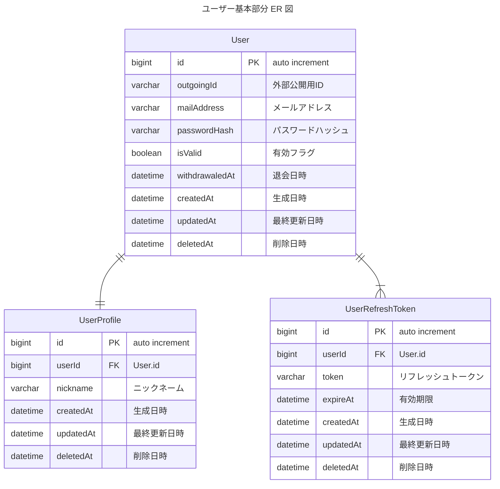

# ER 図

## ユーザー

```mermaid

---
title: ユーザー基本部分 ER 図
---

erDiagram
    User ||--|| UserProfile : ""
    User ||--}| UserRefreshToken: ""

    User {
        bigint id PK "auto increment"
        varchar outgoingId "外部公開用ID"
        varchar mailAddress "メールアドレス"
        varchar passwordHash "パスワードハッシュ"
        boolean isValid "有効フラグ"
        datetime withdrawaledAt "退会日時"
        datetime createdAt "生成日時"
        datetime updatedAt "最終更新日時"
        datetime deletedAt "削除日時"
    }

    UserProfile {
        bigint id PK "auto increment"
        bigint userId FK "User.id"
        varchar nickname "ニックネーム"
        datetime createdAt "生成日時"
        datetime updatedAt "最終更新日時"
        datetime deletedAt "削除日時"
    }

    UserRefreshToken {
        bigint id PK "auto increment"
        bigint userId FK "User.id"
        varchar token "リフレッシュトークン"
        datetime expireAt "有効期限"
        datetime createdAt "生成日時"
        datetime updatedAt "最終更新日時"
        datetime deletedAt "削除日時"
    }
```
